# FOAT - Finding Ore Assets Tool

---

## 📢 소개
**모든 자산이 비싸다고 생각하세요?**  
저평가된 자산을 찾아보세요!

---

## 🚀 설치 및 실행 방법

### 📋 요구 사항
- **Python 버전:** 3.11
- **패키지 버전:** requirements.txt 참고 바람.
  
> **주의:** Python과 패키지는 최신버전이 아니라 위에 언급된 버전으로 설치하세요. 최신버전은 어플이 작동하지 않습니다. (24.12.01. 기준)

### 📥 설치 방법
1. 첨부된 "foat" 폴더를 다운받아 원하는 디렉토리에 넣으십시오.
2. **Anaconda**를 사용하는 경우:
    - **Environments > Create**에서 가상환경(Python 3.11)을 만듭니다.
    - 터미널에 다음 명령어를 입력합니다:
      ```bash
      pip install flask==3.0.2 flask-cors==5.0.0 matplotlib==3.8.0 numpy==1.26.4 yfinance==0.2.48 pandas==2.2.3 requests==2.31.0 bt==1.1.0
      ```
    - 설치한 디렉토리로 이동합니다:
      ```bash
      cd path_to_your_directory (예: cd C:\Foat)
      ```
    - `run.bat` 파일을 실행합니다.
      

---

## 🛠️ 사용 방법

### 🌐 앱 접속
앱에 접속하면 홈 화면이 나타납니다. 화면 왼쪽 아래의 "자산 설정"에서 자신의 자산(달러화 표시)을 설정할 수 있습니다. 한번 설정해보세요.

1. **목표금액 설정:**
    - 현재 설정된 자산에 대해 오른쪽의 "목표금액 설정"을 클릭합니다.
    - 목표 자산과 목표 기간을 입력하면, 매년 달성해야 할 수익률을 제시해줍니다.

> **참고:** 자산 설정 데이터는 웹 브라우저의 `localStorage`에 저장되어 터미널을 종료해도 유지됩니다. 다시 접속하면 이전에 설정한 자산 데이터를 조회할 수 있습니다.

> **주의:** Anaconda 터미널에 `Ctrl+C`를 누르면 앱이 종료됩니다. 또한 약간의 버퍼링은 있을 수 있습니다.


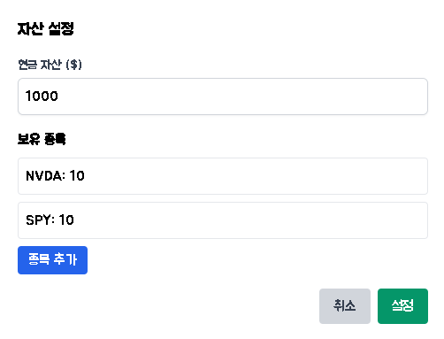    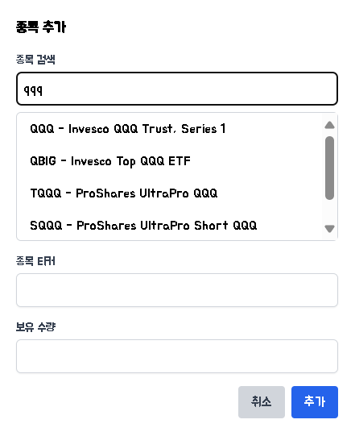  
*위쪽은 "자산 설정"에서 자산 설정 화면, 아래쪽은 "종목 추가"에서 원하는 자산(e.g. QQQ) 검색* 

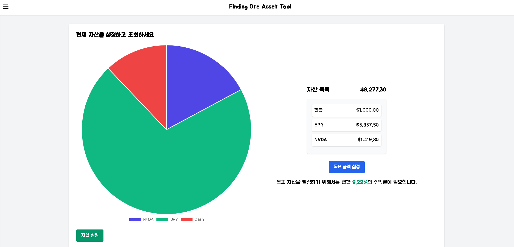  
*"목표금액 설정"에서 목표자산 20000$, 목표기간 10년 설정 예시*

---

### 📊 저평가된 자산 보기
저평가된 자산을 보기 위해 다른 기능을 활용해보세요. 

1. 왼쪽의 삼선 버튼을 클릭하면 **3가지 탭** (Backtesting, 저평가자산분석, 실험실)을 볼 수 있습니다.
   
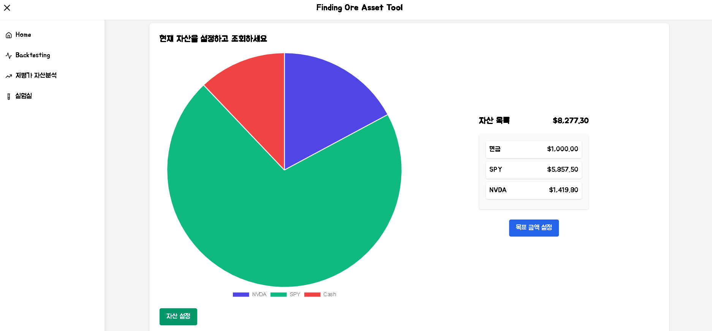
---

## 1. Backtesting

### 🔍 기능 설명
- **자산 조합**과 **기간**을 입력하면, 시작일부터 종료일까지의 수익률 그래프를 보여줍니다.
- **시장 수익률**도 함께 표시되어 선택한 전략과 비교할 수 있습니다.
- 백테스팅 결과는 **foat/static/plots** 에 저장되니 확인하세요.

### 📈 전략 예시
- **자산 조합:** 엔비디아, 삼성, SPY (S&P 500 지수 추종)
- **기간:** 2021/02/02 ~ 2024/11/11

### 📝 전략 종류
1. **매수 & 보유 전략:**
    - 시작일에 자산 조합을 한 번 투자하고 종료일의 평가액을 보여줍니다.
    - 예: 자산 비중을 각각 0.2, 0.2, 0.6으로 설정 (총 비중 합은 1).

    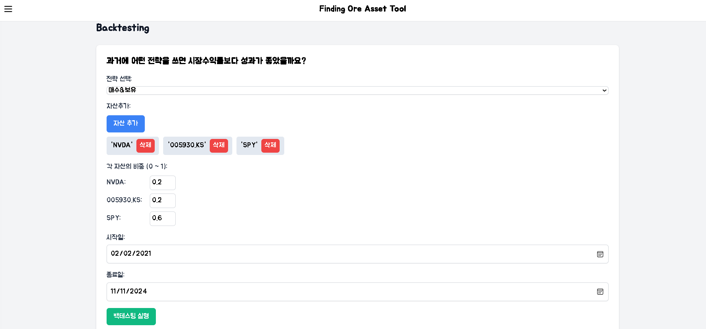
   
   *매수 & 보유 전략 설정*

    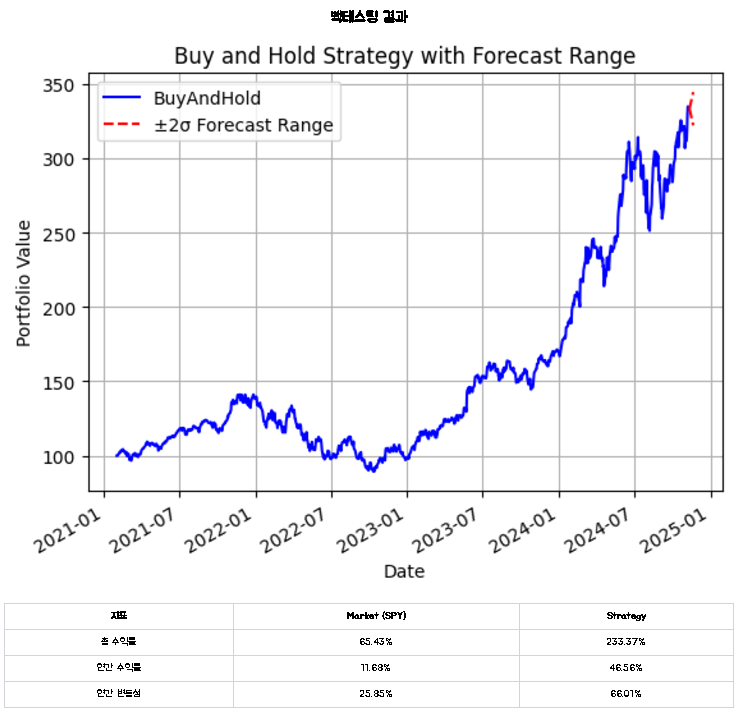
   
   *매수 & 보유 전략 백테스팅 수행 결과*

    - 종료일 근처에 빨간 점선이 표시되며, 하루 수익률의 분포를 기반으로 2표준편차 변동 가능성을 보여줍니다.

3. **분할매수(DCA) 전략:**
    - 자산을 적금식으로 모으는 전략입니다.
    - 각 자산의 비중과 투자 주기를 설정해야 합니다.
    - 예: 매달 투자.

    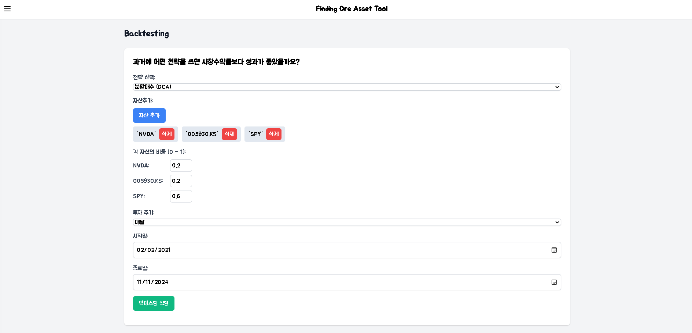
   
   *분할매수 전략 설정*
   
    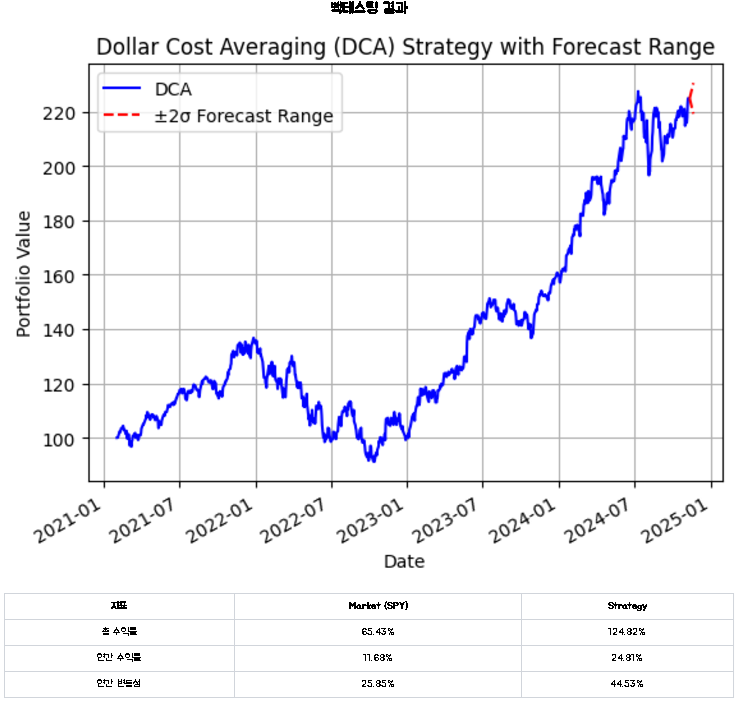
   
    *분할매수 전략 백테스팅 수행 결과*

5. **장단기 이동평균선(MA) 교차 전략:**
    - 단기 MA가 장기 MA 위로 올라가면 매수, 반대면 매도하는 전략입니다.
    - 예: 20일선, 100일선 사용.

    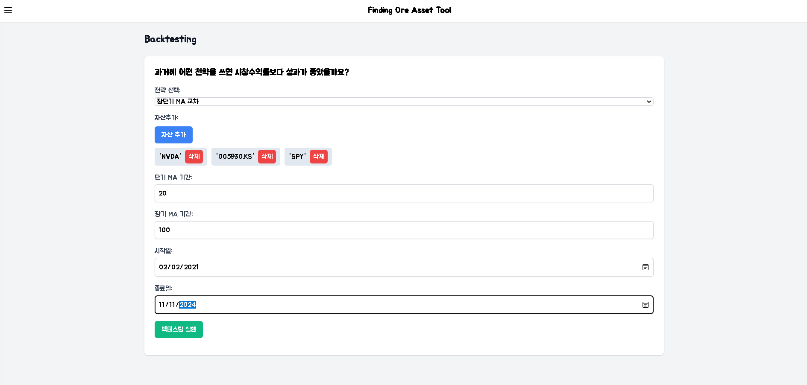
   
    *이동평균선 교차 전략 설정*

    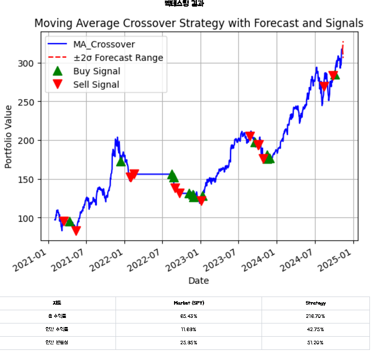
   
    *이동평균선 교차 전략 백테스팅 수행 결과*

    - 수익률 그래프 중간중간에 삼각형이 표시되어 매수/매도 시점을 나타냅니다.

7. **모멘텀 전략:**
    - 최근 n일 동안 성과가 가장 좋은 종목을 매수하는 전략입니다.
    - 모든 자산이 기간 중 하락하면 매수하지 않습니다.
    - 예: lookback 기간 70일 설정.

    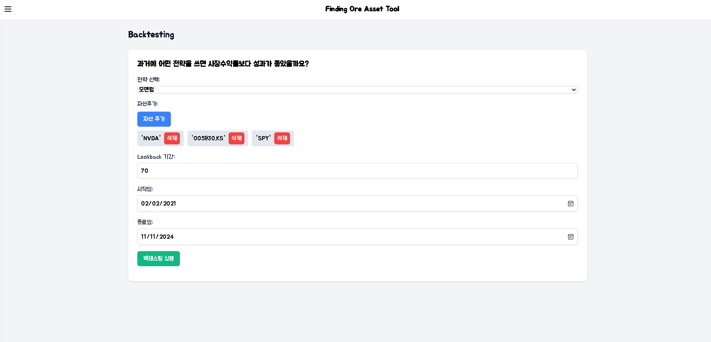
   
    *모멘텀 전략 설정*

    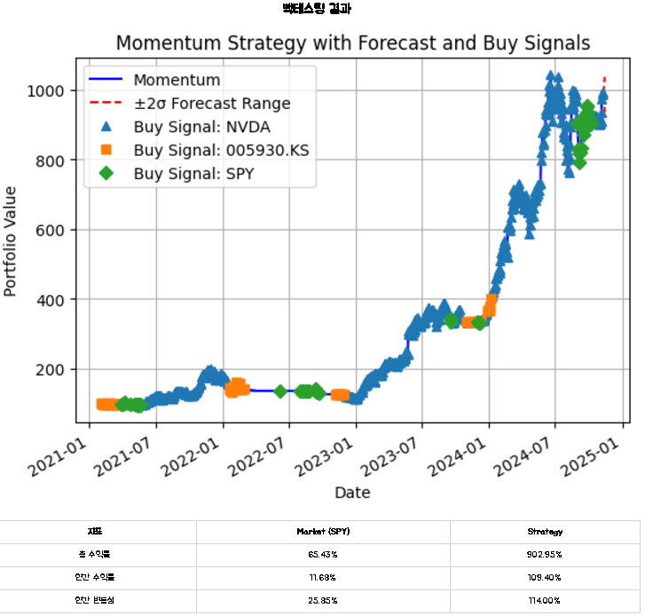
   
    *모멘텀 전략 백테스팅 수행 결과*

    - 수익률 그래프에 여러 심볼이 나타나며, 해당 종목을 매수한 시점을 표시합니다.

---

## 2. 저평가 자산 분석

### 🔍 기능 설명
두 가지 주요 기능을 제공합니다:
1. **상관계수 매트릭스**
2. **자산군 순위**

### 📊 상관계수 매트릭스
- 여러 자산의 주간 수익률 간 상관계수를 최근 데이터로 분석하여 보여줍니다.
- 상관계수 매트릭스는 분석 후 **foat/static/plots** 에 저장되니 확인하세요.
- 예: 서울아파트, SPY, QQQ, GLD, TLT, SOXX, VNQ, XLE, XLF, XLV, BTC-USD의 최근 2년 상관계수 행렬.

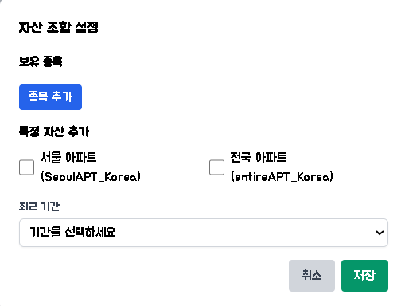 

*"자산조합 설정"에서 자산 검색 화면*

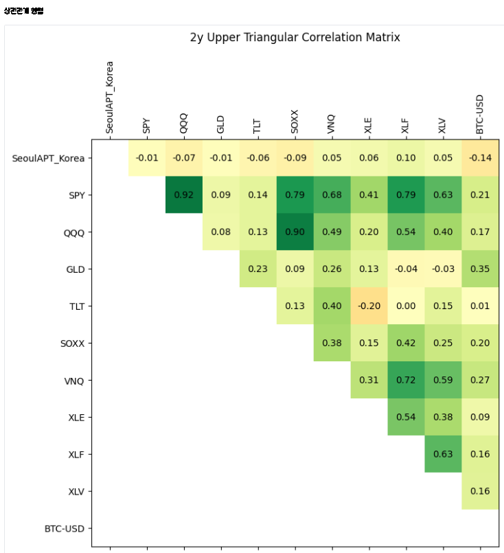  

*e.g. 서울아파트, SPY, QQQ, GLD, TLT, SOXX, VNQ, XLE, XLF, XLV, BTC-USD의 최근 2년 상관계수 행렬*

- 대각성분이 없는 상삼각행렬로 표시되며, 예를 들어 SPY와 VNQ의 상관관계는 0.68으로 유의미함을 알 수 있습니다.
- 또한, TLT(미국 채권 장기물)와 XLE(S&P 500 지수의 에너지 섹터)는 상관관계가 -0.2로, 서로 다른 두 자산을 리밸런싱하여 저평가 자산을 분석할 수 있습니다.

한국부동산 data set 원출처 : https://data.kbland.kr/kbstats/wmh?tIdx=HT01&tsIdx=weekAptSalePriceInx 

### 🏅 자산군 순위
- 연도별 성과가 가장 좋았던 자산을 정렬하여 제공합니다.
- 여러 버튼을 클릭하여 특정 해에 가장 저평가된 자산을 확인할 수 있습니다.

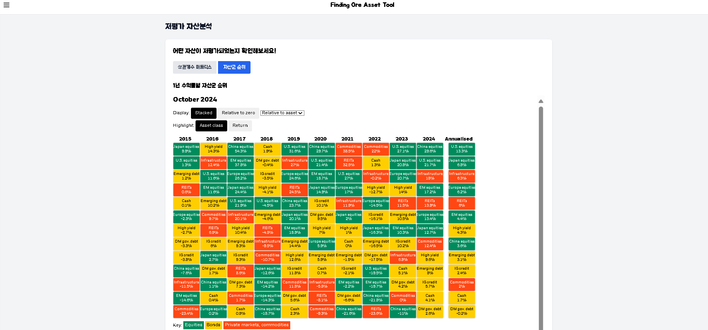  


원출처 : https://www.blackrock.com/corporate/insights/blackrock-investment-institute/interactive-charts/return-map

---

## 3. 실험실

### 🔍 기능 설명
**"공포에 사서 탐욕에 팔아라"라는 말이 있습니다. 정확할까요? Fear & Greed Index**를 활용하여 투자 성과를 분석해보세요.

- 실험 결과는 분석 후 **foat/static/plots** 에 저장되니 확인하세요.

- **Fear & Greed Index:** 0~100 사이의 지수
  - **높을수록 (100에 가까울수록) 탐욕(Greed)**
  - **낮을수록 (0에 가까울수록) 공포(Fear)**

e.g.)
- **투자 전략:**
  - 공포 시(FGI 25) 매수
  - 탐욕 시(FGI 75) 매도
- **지정 기간:** 2015.01.01 ~ 2022.01.01

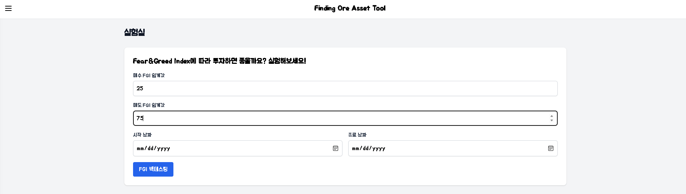  
*실험실 탭에서 투자 파라미터 설정*

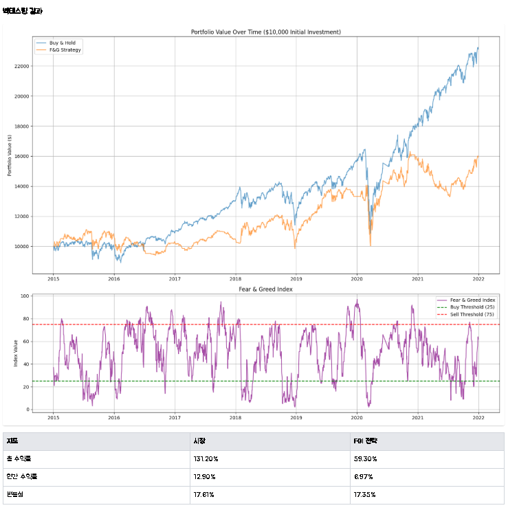  
*실험 결과*

> 위 이미지에서 볼 수 있듯이, 시장 수익률보다 낮은 수익을 기록하였습니다. 다른 기준도 시험해보세요!

data set 원출처 : https://github.com/whit3rabbit/fear-greed-data/tree/main


---

이상으로 **FOAT - Finding Ore Assets Tool**의 모든 기능을 설명했습니다. 저평가된 자산을 효과적으로 찾고 분석하여 보다 현명한 투자 결정을 내리세요!

---

## 🚀 기술 스택

- MVC 패턴을 적용하고, UI/UX를 중점으로 두어 개발함.

## 🎨 **프론트엔드**
- 🧾 **HTML5**: 템플릿 렌더링 및 UI 구조  
- 🎨 **CSS3**: 스타일링 및 레이아웃  
- 💻 **JavaScript**: 사용자 인터랙션 및 동적 콘텐츠 처리  
  - 주요 파일:  
    - 📂 `analysis.js`  
    - 📂 `backtesting.js`  
    - 📂 `home.js`  
    - 📂 `lab.js`  

## ⚙️ **백엔드**
- 🐍 **Python**: Flask 프레임워크 기반 웹 서버  
  - 주요 라이브러리:  
    - 🌐 `Flask`: 백엔드 애플리케이션 서버  
    - 📊 `yfinance`, `bt`: 주식 데이터와 백테스팅  
    - 📈 `pandas`, `numpy`: 데이터 처리 및 분석  
    - 📉 `matplotlib`: 데이터 시각화  
    - 🕒 `datetime`, `time`: 시간 및 날짜 처리  
    - 🛠️ `logging`: 디버깅 및 로그 관리  
- 🖌️ **Flask Template Engine**: Jinja2 기반 템플릿 렌더링  

## 💾 **데이터베이스**
- 🏗️ 오버헤드를 줄이기 위해 로컬 데이터만 사용

---


# LICENSE

This project is distributed under the MIT License.

---

## Third-party Libraries and Resources

This project uses the following third-party libraries and resources. Each library/resource is subject to its own license, as described below.

---

### 1. Flask
- URL: https://flask.palletsprojects.com/
- License: BSD-3-Clause
- Full text: https://opensource.org/licenses/BSD-3-Clause

### 2. Flask-CORS
- URL: https://flask-cors.readthedocs.io/
- License: MIT License
- Full text: https://github.com/corydolphin/flask-cors/blob/develop/LICENSE

### 3. yfinance
- URL: https://github.com/ranaroussi/yfinance
- License: Apache License 2.0
- Full text: https://www.apache.org/licenses/LICENSE-2.0

### 4. pandas
- URL: https://pandas.pydata.org/
- License: BSD-3-Clause
- Full text: https://opensource.org/licenses/BSD-3-Clause

### 5. NumPy
- URL: https://numpy.org/
- License: BSD-3-Clause
- Full text: https://opensource.org/licenses/BSD-3-Clause

### 6. matplotlib
- URL: https://matplotlib.org/
- License: PSF-based License (Python Software Foundation)
- Full text: https://matplotlib.org/stable/users/project/license.html

### 7. requests
- URL: https://docs.python-requests.org/
- License: Apache License 2.0
- Full text: https://www.apache.org/licenses/LICENSE-2.0

### 8. bt (Backtesting Library)
- URL: https://pmorissette.github.io/bt/
- License: MIT License
- Full text: https://github.com/pmorissette/bt/blob/master/LICENSE.txt

---

## External Resources

### 9. Tailwind CSS
- URL: https://tailwindcss.com/
- License: MIT License
- Full text: https://github.com/tailwindlabs/tailwindcss/blob/master/LICENSE

### 10. Google Fonts (Jua, Nanum Gothic Coding)
- URL: https://fonts.google.com/
- License: SIL Open Font License 1.1
- Full text: https://scripts.sil.org/OFL

### 11. Lucide Icons
- URL: https://lucide.dev/
- License: ISC License
- Full text: https://github.com/lucide-icons/lucide/blob/main/LICENSE

---

## Notes on Custom Code
All custom Python and CSS code written for this project is distributed under the MIT License.

If you have questions regarding license compatibility or usage, please contact the project maintainers.


